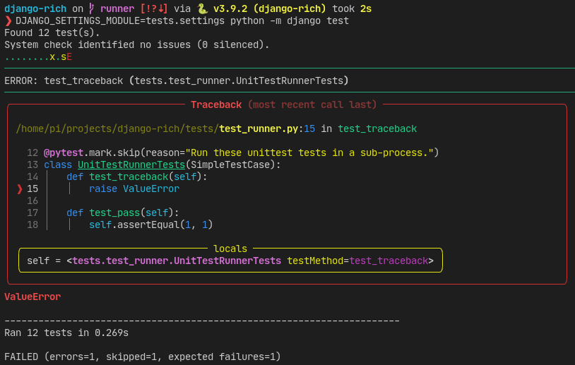

===========
django-rich
===========

.. image:: https://img.shields.io/github/workflow/status/adamchainz/django-rich/CI/main?style=for-the-badge
   :target: https://github.com/adamchainz/django-rich/actions?workflow=CI

.. image:: https://img.shields.io/badge/Coverage-100%25-success?style=for-the-badge
  :target: https://github.com/adamchainz/django-rich/actions?workflow=CI

.. image:: https://img.shields.io/pypi/v/django-rich.svg?style=for-the-badge
   :target: https://pypi.org/project/django-rich/

.. image:: https://img.shields.io/badge/code%20style-black-000000.svg?style=for-the-badge
   :target: https://github.com/psf/black

.. image:: https://img.shields.io/badge/pre--commit-enabled-brightgreen?logo=pre-commit&logoColor=white&style=for-the-badge
   :target: https://github.com/pre-commit/pre-commit
   :alt: pre-commit

Extensions for using `Rich <https://rich.readthedocs.io/>`__ with Django.

Requirements
------------

Python 3.7 to 3.10 supported.

Django 2.2 to 4.0 supported.

----

**Want to work smarter and faster?**
Check out my book `Boost Your Django DX <https://adamchainz.gumroad.com/l/byddx>`__ which covers many ways to improve your development experience.
I wrote django-rich whilst working on the book!

----

Installation
------------

1. Install with **pip**:

   .. code-block:: sh

       python -m pip install django-rich

Reference
---------

``django_rich.management.RichCommand``
^^^^^^^^^^^^^^^^^^^^^^^^^^^^^^^^^^^^^^

A subclass of Django’s |BaseCommand|__ class that sets its ``self.console`` to a Rich |Console|__.
The ``Console`` uses the command’s ``stdout`` argument, which defaults to ``sys.stdout``.
Colourization is enabled or disabled according to Django’s ``--no-color`` and ``--force-color`` flags.

.. |BaseCommand| replace:: ``BaseCommand``
__ https://docs.djangoproject.com/en/stable/howto/custom-management-commands/#django.core.management.BaseCommand

.. |Console| replace:: ``Console``
__ https://rich.readthedocs.io/en/stable/console.html

You can use ``self.console`` like so:

.. code-block:: python

    from django_rich.management import RichCommand

    class Command(RichCommand):
        def handle(self, *args, **options):
            self.console.print("[bold red]Alert![/bold red]")

You can customize the construction of the ``Console`` by overriding the ``make_rich_console`` class attribute.
This should be a callable that returns a ``Console``, such as a |functools.partial|__.
For example, to disable the default-on ``markup`` and ``highlighting`` flags:

.. |functools.partial| replace:: ``functools.partial``
__ https://docs.python.org/3/library/functools.html#functools.partial

.. code-block:: python

    from functools import partial

    from django_rich.management import RichCommand
    from rich.console import Console

    class Command(RichCommand):
        make_rich_console = partial(Console, markup=False, highlight=False)

        def handle(self, *args, **options):
            ...

``django_rich.test.RichRunner``
^^^^^^^^^^^^^^^^^^^^^^^^^^^^^^^

A subclass of Django's |DiscoverRunner|__ with colourized outputs and ``Rich`` |Tracebacks|__.

.. |DiscoverRunner| replace:: ``DiscoverRunner``
__ https://docs.djangoproject.com/en/stable/topics/testing/advanced/#defining-a-test-runner

.. |Tracebacks| replace:: ``Tracebacks``
__ https://rich.readthedocs.io/en/stable/traceback.html

To use the runner in your ``settings.py`` file add a |TEST_RUNNER|__ setting with the value ``"django_rich.test.RichRunner"``.

.. |TEST_RUNNER| replace:: ``TEST_RUNNER``
__ https://docs.djangoproject.com/en/4.0/ref/settings/#std:setting-TEST_RUNNER
